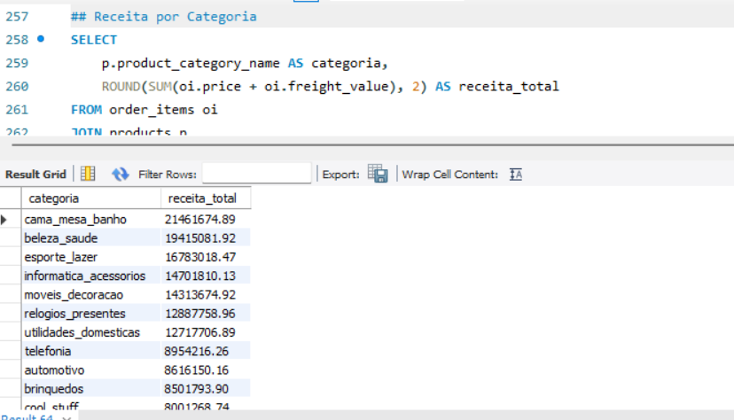
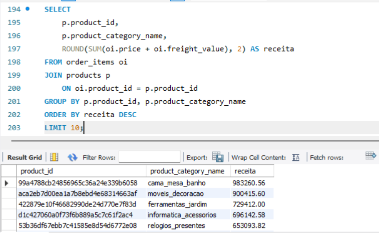
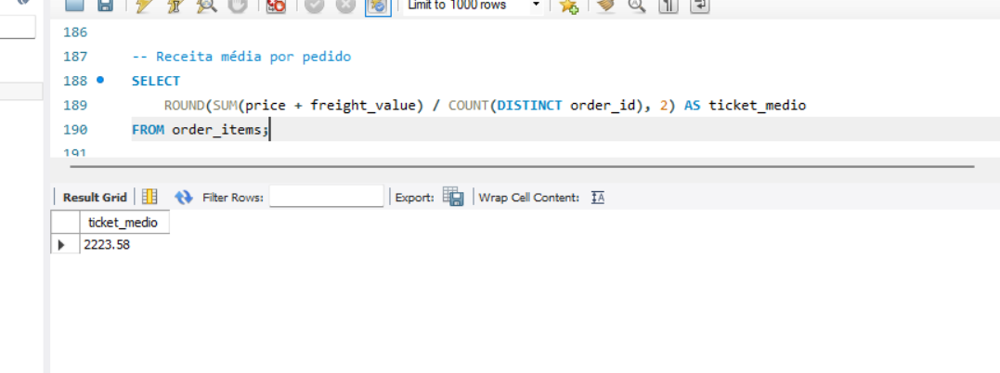
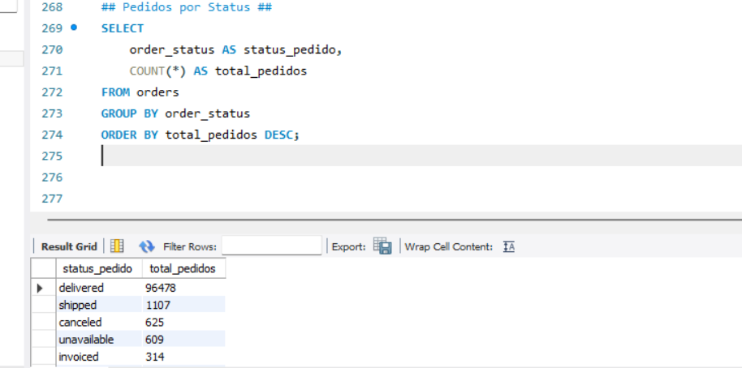
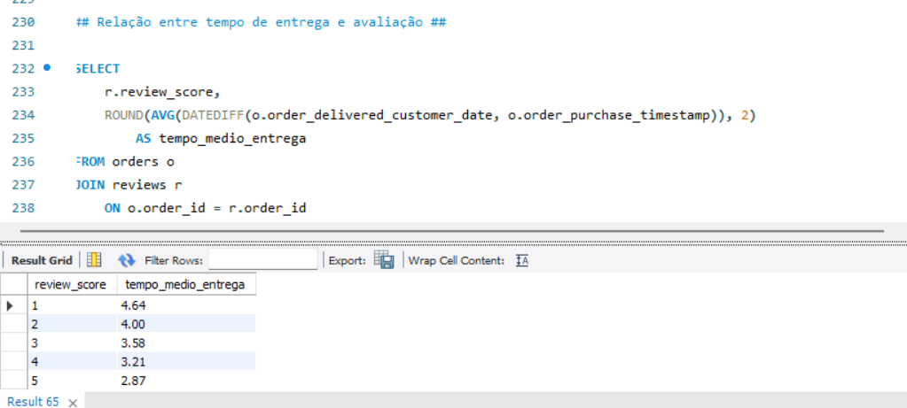

🛒 Análise de Dados em SQL — E-commerce Brasileiro (Olist)
📌 Visão Geral

Este projeto tem como objetivo analisar dados reais de um e-commerce brasileiro utilizando SQL (MySQL).
Foram explorados dados de pedidos, clientes, produtos, vendedores, pagamentos e avaliações para responder perguntas de negócio e gerar insights analíticos relevantes.

O dataset utilizado é público e amplamente reconhecido na comunidade de dados, permitindo simular um cenário real de análise em ambiente relacional.

🗂️ Base de Dados

Fonte: Brazilian E-Commerce Public Dataset by Olist (Kaggle)

Formato: CSV

Período: 2016 – 2018

Volume: ~100 mil pedidos

Principais Tabelas

customers

orders

order_items

products

sellers

payments

reviews

🛠️ Tecnologias Utilizadas

MySQL

MySQL Workbench

SQL (DDL, DML e consultas analíticas)

Git & GitHub

🧱 Estrutura do Projeto
olist-analise-sql/
│
├── sql/
│   ├── 01_criacao_tabelas.sql
│   ├── 02_carga_dados.sql
│   └── 03_consultas_analiticas.sql
│
├── images/
│   └── (prints das consultas e resultados)
│
├── data/
│   └── (dados locais – ignorados via .gitignore)
│
├── .gitignore
└── README.md

⚙️ Etapas do Projeto
1️⃣ Criação do Modelo Relacional

Criação das tabelas no MySQL

Definição de chaves primárias

Tipagem adequada das colunas

Organização lógica do schema

📄 Script: 01_criacao_tabelas.sql

2️⃣ Carga de Dados

Importação dos arquivos CSV

Tratamento de headers

Ajustes de encoding e tipos

Validação da carga com consultas de conferência

📄 Script: 02_carga_dados.sql

3️⃣## 📊 Consultas Analíticas e Métricas de Negócio

### Receita por Categoria de Produto
A análise abaixo mostra as categorias que mais geram receita no e-commerce.

---

### Top 10 Categorias por Receita
Ranking das categorias com maior faturamento total.

---

### Ticket Médio
Valor médio gasto por pedido.

---

### Pedidos por Status
Distribuição dos pedidos ao longo do fluxo operacional.

---

### Tempo de Entrega x Avaliação
Relação entre prazo de entrega e satisfação do cliente.

📊 Exemplos de Análises

Categorias como cama_mesa_banho, beleza_saude e esporte_lazer concentram grande parte da receita.

Pedidos com menor tempo de entrega apresentam avaliações médias mais altas.

Cartão de crédito é o meio de pagamento predominante.

A maior parte dos pedidos está concentrada na região Sudeste.

(prints das consultas podem ser encontrados na pasta /images)

🎯 Principais Aprendizados

Modelagem relacional aplicada a um cenário real

Uso de SQL para análise exploratória e analítica

Identificação de gargalos logísticos

Tradução de dados em insights de negócio

Boas práticas de organização de projetos SQL no GitHub

📎 Observações

Os dados brutos não são versionados por boas práticas de repositório.

Projeto com foco educacional e demonstrativo, simulando desafios reais de análise em SQL.
